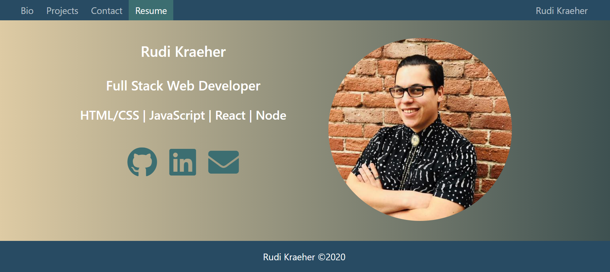

# Portfolio

## Description
    This is my professional full stack developer portfolio.
    
## Table of Contents 
1. [Usage](#usage)
3. [Technologies](#technologies)
4. [Demo](#demo)
5. [Attributions](#attributions)
6. [Questions](#questions)
    
## Usage
Visit my portfolio here: https://rkraeher.github.io/react-portfolio/

## Technologies
React.js, Ant Design, Font Awesome

## Demo
  

## Attributions
<a href="https://www.vecteezy.com/free-vector/portfolio-icon"
  target="blank_">Portfolio Icon Vectors by Vecteezy.</a>
  
Photos by 
<a href="https://unsplash.com/@jd_alon?utm_source=unsplash&utm_medium=referral&utm_content=creditCopyText"
  target="blank_" > Jose Alonso,</a>
<a href="https://unsplash.com/@aaronburden?utm_source=unsplash&utm_medium=referral&utm_content=creditCopyText"
  target="blank_"> Aaron Burden,</a> 
<a href="https://unsplash.com/@xangriffin?utm_source=unsplash&utm_medium=referral&utm_content=creditCopyText"
  target="blank_"> Xan Griffin,</a>
and<a href="https://unsplash.com/@kellysikkema?utm_source=unsplash&utm_medium=referral&utm_content=creditCopyText"
  target="blank_"> Kelly Sikkema</a> 
on<a href="https://unsplash.com/" 
  target="blank_"> Unsplash</a>

## License 
  
Copyright (c) 2021 Rudi Kraeher
        
## Questions
If you have any questions you can email me at rudikraeher@gmail.com.  
Visit my [GitHub](https://github.com/rkraeher) to see more of my work.